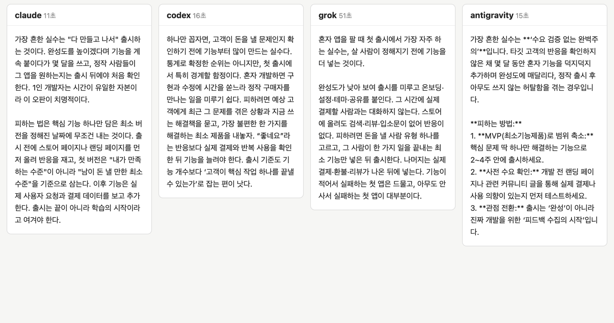
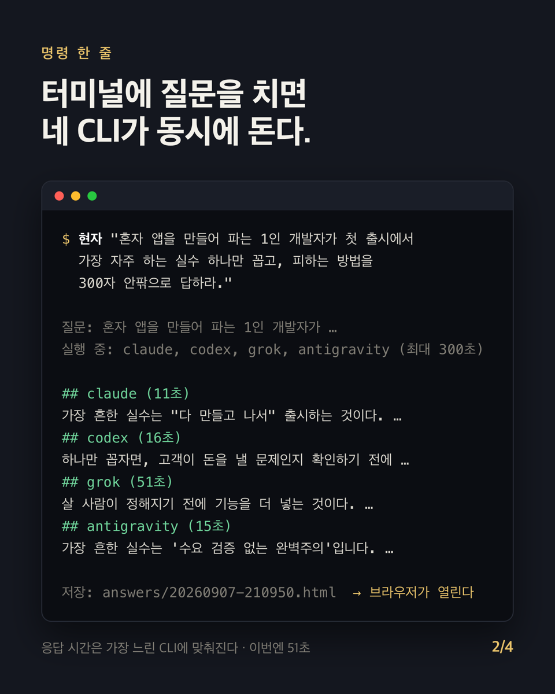

# 현자(賢者)

같은 질문을 Claude, Codex, Grok, Antigravity 네 CLI에 동시에 던지고, 네 답을 한 화면에 나란히 놓고 읽는다.

```
현자 "혼자 앱을 만들어 파는 1인 개발자가 첫 출시에서 가장 자주 하는 실수 하나만 꼽아라."
```



- 파이썬 파일 하나. 외부 라이브러리 없음.
- 네 CLI를 스레드로 동시에 돌리고, 마크다운과 HTML 두 형식으로 저장한 뒤 브라우저를 연다.
- 작업 폴더의 `AGENTS.md`가 네 CLI에 같은 지침(한국어, 결론 먼저, 300자 안팎, 파일 읽지 않기)을 준다.
- Claude Code·Codex의 스킬로도 등록된다. "현자에게 물어봐"라고 하면 에이전트가 대신 실행한다.

## 설치

먼저 쓰려는 CLI에 각각 로그인돼 있어야 한다. 없는 CLI는 그 열이 "(CLI 없음)"으로 표시될 뿐 나머지는 정상 동작한다.

| 이름 | CLI | 검증한 버전 |
|---|---|---|
| claude | [Claude Code](https://docs.anthropic.com/claude-code) `claude` | 2.1.263 |
| codex | [OpenAI Codex CLI](https://github.com/openai/codex) `codex` | 0.153.4 |
| grok | xAI Grok Build CLI `grok` (`~/.grok/bin/grok`에 설치되는 것) | 1.0.13 |
| antigravity | [Antigravity](https://antigravity.google) `agy` | 1.1.27 |

검증 환경: macOS 26.6, Python 3.9. 윈도우 설치기는 이전 기기(Windows 11)에서 쓰던 구조를 옮긴 것으로, 이번 정리 뒤에는 다시 검증하지 않았다.

### macOS · Linux

```bash
git clone https://github.com/formars0309-cloud/hyunja ~/Projects/hyunja
sh ~/Projects/hyunja/install.sh
```

`~/.local/bin/현자`와 `askall` 명령, `~/.claude/skills/현자`·`~/.codex/skills/현자` 링크가 생긴다. `~/.local/bin`이 PATH에 없으면 설치기가 알려준다.

### 윈도우

```
git clone https://github.com/formars0309-cloud/hyunja %USERPROFILE%\Projects\hyunja
%USERPROFILE%\Projects\hyunja\install.cmd
```

`askall.cmd`·`hyunja.cmd` 명령이 생긴다. 배치 파일은 ASCII만 담고 한글 경로는 파이썬이 다루는데, 콘솔 코드페이지 65001에서 cmd.exe가 한글이 든 줄을 어긋나게 읽기 때문이다.

## 사용

```
현자 "질문"                      # 네 CLI 모두. askall "질문" 도 같다
askall -a claude,grok "질문"     # 일부만
askall -t 600 "질문"             # 타임아웃 초 (기본 300)
askall --no-open "질문"          # 브라우저 안 열기
echo "여러 줄 질문" | askall     # stdin
```



결과는 작업 폴더의 `answers/<시각>.md`와 `.html`로 남는다. 응답 시간은 가장 느린 CLI에 맞춰진다.

## 설정

| 환경변수 | 기본값 | 뜻 |
|---|---|---|
| `HYUNJA_HOME` | `~/.hyunja` | 작업 폴더. 네 CLI가 여기서 실행되고 답이 여기 쌓인다 |
| `HYUNJA_COMMIT` | 없음 | `1`이면 작업 폴더가 git 저장소일 때 답을 곧바로 커밋한다 (`--commit`과 같음) |

`~/.config/hyunja/env`에 `KEY=VALUE`로 적어 둬도 된다. 답변 방식(언어, 길이, 말투)을 바꾸려면 작업 폴더의 `AGENTS.md`를 고친다. 처음 실행할 때 `templates/`의 파일이 복사된다.

## 한계

- 네 CLI는 현재 프로젝트가 아니라 작업 폴더에서 돈다. 프로젝트 코드를 봐야 하는 질문에는 맞지 않는다.
- Gemini CLI는 2026-06-18부터 개인 구글 계정 로그인이 막혀 Antigravity CLI(`agy`)로 대신한다. `-a gemini`는 옛 이름으로 남겨 두었고 같은 `agy`를 부른다.
- `agy`는 처음 한 번 터미널에서 `agy`를 실행해 브라우저 로그인을 마쳐야 한다.

## 라이선스

MIT
